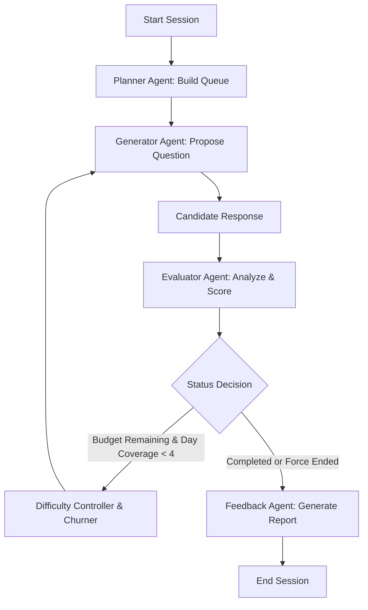

# Interviu — Adaptive AI Technical Interviewer

> **Hackathon**: ABTalks Vibe Coding Hackathon  
> **Architecture**: LangGraph, FastAPI, In-Memory RAG, Pydantic V2  

---

## 🚀 Executive Summary

**Interviu** is a stateful, adaptive AI technical interviewer designed to conduct automated, real-time developer assessments. By orchestrating a cyclic state machine with **LangGraph** and matching questions against a localized **Curriculum Indexer (RAG)**, Interviu guarantees strict concept coverage, calibrates question difficulty dynamically based on candidate signals, and synthesizes detailed, hiring-manager-grade feedback reports.

---

## 🎨 Interactive Landing Page

The project features a premium, responsively stacked developer interface built using glassmorphic cards, lavender ambient glow gradients, and subtle rotating neural visualizations.

- **Desktop View**: A two-column dashboard previewing candidate profile (`Sarah Johnson`), current topic, active question card, and interview progress.
- **Mobile View**: Intelligently stacked layouts optimized for smaller screens with horizontal overflow protection.
- **Static Assets**: Direct serving via FastAPI routes, making frontend hosting zero-configuration.

---

## 🛠️ Technical Architecture

Interviu's evaluation engine is modeled as a state machine using **LangGraph**. The execution flow runs cyclically on each candidate turn:



### Core Components
1. **Stateful LangGraph Orchestration**: Loops dynamically through planning, generation, answer scoring, and feedback synthesis nodes.
2. **Dynamic Calibration**: Uses consecutive response tracking to step-up or step-down difficulty levels (`very_easy`, `easy`, `medium`, `medium_plus`, `hard`).
3. **Deterministic Curriculum RAG**: Uses a fast in-memory keyword matching indexer (`CurriculumIndexer`) to retrieve grounded learning concepts.
4. **Hiring Report Generation**: Creates detailed candidate assessments with topic metrics, strengths, growth areas, and hiring recommendations.

---

## 📂 Repository Structure

```
d:/Interviu/
├── app/
│   ├── config/          # Environment settings & constraints
│   ├── schemas/         # Pydantic validation schemas & InterviewState
│   ├── models/          # Domain dataclasses
│   ├── utils/           # LLM clients, loggers, and formatters
│   ├── retrieval/       # Curriculum chunker & in-memory keyword retriever
│   ├── evaluation/      # Difficulty controller & coverage checkers
│   ├── prompts/         # Role-anchored templates
│   ├── agents/          # Planner, Generator, Evaluator, Feedback agents
│   ├── graph/           # LangGraph workflow graphs & conditional routing
│   ├── services/        # Session manager & interview engine
│   ├── routers/         # FastAPI REST endpoints
│   └── main.py          # FastAPI application entrypoint
├── tests/               # Pytest unit & API integration test suite
├── PROMPTS.md           # Continuous AI usage hackathon log
├── implementation_plan.md # Engineering design blueprint
├── requirements.txt     # Python dependency manifest
└── README.md            # Project documentation (this file)
```

---

## ⚡ Quick Start

### 1. Installation
Install the required dependencies (cleanly packaged without heavy C++ compiling requirements):
```bash
python -m pip install -r requirements.txt
```

### 2. Environment Variables
Copy `.env.example` to `.env` and fill in your keys:
```bash
GROQ_API_KEY=your_groq_api_key
STITCH_API_KEY=your_stitch_api_key
PRIMARY_LLM_PROVIDER=groq
PRIMARY_MODEL_NAME=qwen/qwen3.6-27b
```

### 3. Start local development server
```bash
python -m uvicorn app.main:app --reload --port 8000
```
- Access the Web UI interface: `http://localhost:8000/`
- Access interactive API docs: `http://localhost:8000/docs`

### 4. Run tests
```bash
python -m pytest -v
```

---

## 📄 License

This project is licensed under the MIT License - see the [LICENSE](file:///d:/Interviu/LICENSE) file for details.

